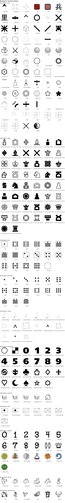

# Abstract Play Renderer

This private NPM module graphically renders game states. This repository houses the authoritative JSON schema.

Currently the only supported output format is SVG. The library has been tested and works correctly in Chrome, Firefox, Opera, and Edge.

[A playground/demo area is now available.](https://renderer.dev.abstractplay.com) The [Abstract Play Designer](https://designer.abstractplay.com/) is another place you can interact with the rendering engine.

## Usage

In the browser, simply load `APRender.js` via a `<script>` tag. For a concrete example, [see the playground](https://renderer.dev.abstractplay.com).

From within Node, simply import the variables and functions you need. Both methods give you access to the same API.

The API and schema are documented on the [docs site](https://docs.abstractplay.com/renderer/).

## Contributing

If you want to create a new set of graphics, see [Adding pieces](https://docs.abstractplay.com/renderer/adding-pieces/) and the [contact sheet](https://docs.abstractplay.com/renderer/contact-sheet/) for existing piece names.

The contact sheet (`docs/contact-sheet.svg`) is updated manually when sheets change; it is not generated by the build.

## Contact

The [main website](https://www.abstractplay.com) houses the development blog and wiki. We encourage coders to join us on Discord (<https://discord.abstractplay.com>) in our `#dev-curious` channel if you have questions, and basic docs are available [on our wiki](https://abstractplay.com/wiki/doku.php?id=coding_docs).

## Deploy

This is a basic NPM module; it's just private. It's not meant to be generally useful to anyone outside of myself. It is designed specifically for Abstract Play. If someone does use this elsewhere, let me know :)

- Clone the repo.
- From the newly created folder, run the following commands:
  - `npm install` (installs dependencies)
  - `npm run test` (makes sure everything is working)
  - `npm run build` (compiles the TypeScript files into the `./build` folder)
  - `npm run dist-dev` (or `dist-prod` if you want it minified; bundles everything for the browser into the `./dist` folder)
