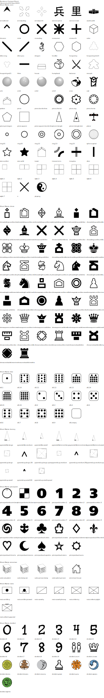

# Abstract Play Renderer

This private NPM module graphically renders game states. This repository houses the authoritative JSON schema.

Currently the only supported output format is SVG.

## Contributing

If you want to create a new set of graphics, then I'm afraid you have to get your hands a little dirty. You will need to learn [TypeScript](https://www.typescriptlang.org/) and [SVG.js](https://svgjs.com/). For now, see the `src/sheets/default.ts` file for how this works. Once complete, submit a pull request and I'll consider it.

Detailed instructions will appear here once the API is stable. For now, here's just a collection of points so I don't forget them:

- The size of SVG you return is irrelevant. It will be scaled by the renderer as appropriate. Use whatever size is convenient for you.
- The renderer will check each figure for an element with the `id` `playerfill` and `fill` that element with the colour for the given player based on the options passed to the renderer (e.g., colour-blind palette).

## Contact

The [main website](https://www.abstractplay.com) houses the development blog and wiki.

## Deploy

This is a basic NPM module; it's just private. It's not meant to be generally useful to anyone outside of myself. It is designed specifically for Abstract Play. If someone does use this elsewhere, let me know :)

- Clone the repo.
- From the newly created folder, run the following commands:
  - `npm install` (installs dependencies)
  - `npm run test` (makes sure everything is working)
  - `npm run build` (compiles the TypeScript files into the `./build` folder)
  - `npm run dist-dev` (or `dist-prod` if you want it minified; bundles everything for the browser into the `./dist` folder)
