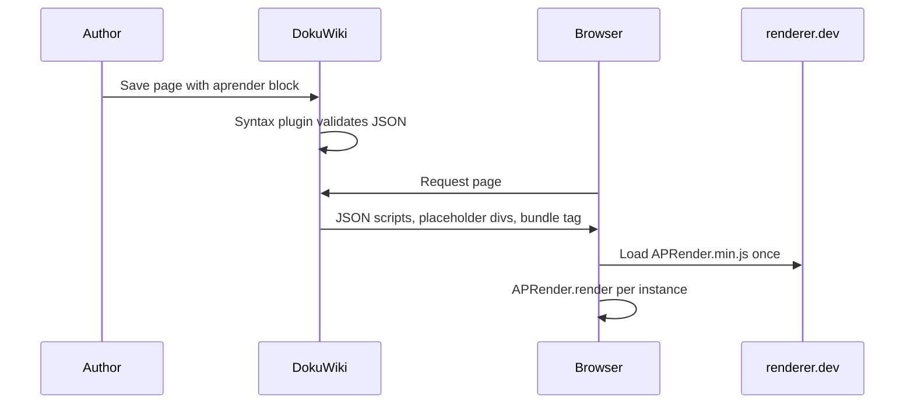

# DokuWiki AP Renderer Plugin

Embed [Abstract Play](https://abstractplay.com) renderer JSON in wiki pages as live SVG board diagrams. Rendering happens in the reader's browser via `APRender.min.js`, the same bundle used by the [renderer playground](https://renderer.dev.abstractplay.com).

## Requirements

- DokuWiki 2023-04-04a "Jack Jackrum" or compatible
- Outbound HTTPS access to the configured renderer bundle URL (default: `https://renderer.dev.abstractplay.com/APRender.min.js`)
- Wiki editors need normal page edit permission (no `htmlok` required)

---

## Admin: install

1. **Confirm the renderer bundle is available.** The default URL is served by the renderer deploy pipeline (`npm run deploy` in the [renderer repo](https://github.com/AbstractPlay/renderer)). Open the URL in a browser to verify it loads.

2. **Copy the plugin** into your DokuWiki install:

   ```text
   contrib/dokuwiki-plugin-aprender/  →  {wiki-root}/lib/plugins/aprender/
   ```

   The wiki plugin directory must be named `aprender` (matching the plugin base name).

3. **Enable the plugin.** In the wiki admin UI: **Admin → Extension Manager**. Find **Abstract Play Renderer** and enable it.

4. **Review settings (optional).** **Admin → Configuration Settings → aprender**:
   - **bundle URL** — override if you self-host `APRender.min.js`
   - **maximum JSON size** — default 65536 bytes per block

5. **Purge the wiki cache** so existing pages pick up the plugin. Any one of these works:

   - **Admin UI:** open **Configuration Settings**, change nothing, and click **Save** (this touches `conf/local.php` and invalidates all render cache).
   - **Single page:** append `?purge=true` to the page URL while logged in as admin, e.g. `https://abstractplay.com/wiki/doku.php?id=test&purge=true`.
   - **Shell:** from the wiki root, `touch conf/local.php` (same effect as Save in Configuration Settings).
   - **Nuclear option:** stop the web server if needed, delete files under `data/cache/` (not `data/cache/attic/` or `data/cache/purgefile`), then reload.

   Older installs may not have `bin/index.php`; the methods above do not require it.

6. **Smoke-test.** Create a test page with the minimal example below, save, and confirm the board renders.

---

## Admin: upgrade

1. Replace the files under `lib/plugins/aprender/` with the new version from this directory.
2. Purge the wiki cache (see [Admin: install](#admin-install) step 5).
3. If the renderer had a major schema change, open an existing `<aprender>` page and confirm it still renders. Update the bundle URL if you pin a self-hosted copy.

---

## Admin: troubleshooting

| Symptom | What to check |
|---------|----------------|
| Nothing appears (no board, no error) | **Do not wrap the block in a code fence** (`<code>`, ` ``` `, or indented preformatted text). Tags must be raw wiki text. Purge cache (`?purge=true`). View page source: search for `class="aprender"` — if missing, syntax did not run. |
| Empty placeholder box | Browser devtools console for JS errors; confirm the bundle URL loads (ad blockers, CSP, offline CDN). View source: `id="aprender-bundle"` script tag should appear above the diagram. |
| "Invalid JSON" on save/preview | Paste the JSON into the [playground](https://renderer.dev.abstractplay.com) first; fix syntax errors. |
| "Invalid JSON in settings attribute" | Check `settings='...'` is valid JSON; use single quotes around the attribute value. |
| Schema error shown in the box | JSON must match the [renderer schema](https://docs.abstractplay.com/renderer/schema-reference/). |
| Works only after cache purge | Normal after plugin install or upgrade — purge cache. |
| Fatal error about `handle` method | Plugin version mismatch — update to the current `syntax.php` (DokuWiki 2023 API) and purge cache. |
| Bundle never requested | Page has no `<aprender>` blocks, or cached HTML predates plugin install — purge cache and reload. |
| Multiple boards, only one shows | Should not happen (each instance gets a unique ID and SVG `prefix`); file a bug if it does. |

### Content-Security-Policy

If your wiki sends a strict CSP, allow the bundle host in `script-src`, for example:

```text
script-src ... https://renderer.dev.abstractplay.com;
```

### Self-hosting the bundle

Build from the renderer repo (`npm run dist-prod`), copy `dist/APRender.min.js` to your web server, and set **bundle URL** in plugin settings to that URL.

---

## Author: usage

### Basic syntax

Put render JSON between opening and closing tags on their own lines:

```text
<aprender>
{
  "board": { "style": "hexes", "width": 3, "height": 3 },
  "legend": { "A": { "name": "go-stone", "colour": 1 } },
  "pieces": "A"
}
</aprender>
```

### Optional layout attributes

Add attributes to the opening tag for display tweaks. Layout attributes override the same keys in `settings` when both are present.

| Attribute | Effect | Example |
|-----------|--------|---------|
| `rotate` | Rotate the board (degrees) | `<aprender rotate="90">` |
| `colourblind` | Colour-blind-friendly palette shortcut | `<aprender colourblind>` |
| `width` | Width of the diagram frame | `<aprender width="400">` or `<aprender width="50%">` |
| `height` | Height of the diagram frame | `<aprender height="300">` or `<aprender height="50%">` |
| `scale` | Uniform scale factor | `<aprender scale="50%">` or `<aprender scale="0.5">` |

Bare numbers are pixels (`400` → `400px`). `width` percentages are relative to the wiki content column. **`height` percentages use the viewport** (`height="50%"` → `50vh`) because article pages have no parent height for CSS `%` to resolve against.

Use `width` alone to scale proportionally. Use `width` + `height` for a fixed box (the board letterboxes inside). `scale` shrinks the whole frame visually without changing layout flow much.

### Customization (`settings` attribute)

Renderer customization (colours, colour context, glyph swaps, palette) goes in a **`settings` JSON attribute** on the opening tag. Use the same shape as the playground **settings** box:

```text
<aprender settings='{"colourContext":{"background":"#111","fill":"#222","strokes":"#888","borders":"#666","labels":"#ccc","annotations":"#f0f0f0"},"palette":["#e31a1c","#1f78b4"]}'>
{
  "board": { "style": "squares-checkered", "width": 8, "height": 8 },
  "legend": {
    "A": { "name": "piece", "colour": 1 },
    "B": { "name": "piece", "colour": 2 }
  },
  "pieces": "BBBBBBBB\nBBBBBBBB\n_\n_\n_\n_\nAAAAAAAA\nAAAAAAAA"
}
</aprender>
```

Wrap the attribute in **single quotes** so the JSON inside can use double quotes without escaping.

| `settings` key | Maps to | Notes |
|----------------|---------|--------|
| `colourContext` | `colourContext` | `background`, `fill`, `strokes`, `borders`, `labels`, `annotations`, `board` |
| `palette` | `colours` | Playground name; hex strings, `null`, or pattern ids |
| `colours` | `colours` | Direct API name (alternative to `palette`) |
| `glyphmap` | `glyphmap` | `[["requestedGlyph","replacementGlyph"], ...]` |
| `colourBlind` | `colourBlind` | `true` for colour-blind palette |
| `patterns` | `patterns` | Pattern-based player colours |
| `patternList` | `patternList` | Pattern ids for default slots |
| `showAnnotations` | `showAnnotations` | Show move annotations |
| `rotate` | `rotate` | Prefer the `rotate` tag attribute for simple cases |

**Merge order:** `settings` JSON is applied first; layout tag attributes (`rotate`, `colourblind`, `width`, `height`, `scale`) override on conflict.

### Customization in render JSON

Board layout, pieces, legend glyphs, markers, and annotations belong in the **render JSON body**, not in `settings`:

| Need | Where in JSON |
|------|----------------|
| Board topology, labels, markers | `board` |
| Piece appearance | `legend` |
| Renderer flags (`hide-labels`, `no-piece-click`, …) | top-level `options` array |
| Annotations | top-level `annotations` array — omit entries you do not want shown |

Reference: [renderer docs](https://docs.abstractplay.com/renderer/) and [schema reference](https://docs.abstractplay.com/renderer/schema-reference/).

### Creating JSON

1. Use the [renderer playground](https://renderer.dev.abstractplay.com) or [designer](https://designer.abstractplay.com) to build and tweak a position.
2. Copy the **render JSON** into the block body.
3. Copy the playground **settings JSON** into `settings='...'` on the opening tag (if customization is needed).
4. Save the wiki page.

Reference documentation: [docs.abstractplay.com/renderer](https://docs.abstractplay.com/renderer/).

### Example: simple pieces on a checkered board

```text
<aprender>
{
  "board": { "style": "squares-checkered", "width": 8, "height": 8 },
  "legend": {
    "A": { "name": "piece", "colour": 1 },
    "B": { "name": "piece", "colour": 2 }
  },
  "pieces": "BBBBBBBB\nBBBBBBBB\n_\n_\n_\n_\nAAAAAAAA\nAAAAAAAA"
}
</aprender>
```

### Example: empty Go board

```text
<aprender>
{
  "board": { "style": "vertex", "width": 19, "height": 19 },
  "legend": {
    "A": { "name": "piece", "colour": 1 },
    "B": { "name": "piece", "colour": 2 }
  },
  "pieces": null
}
</aprender>
```

### Tips

- **Do not use code blocks.** The `<aprender>` tags must be plain wiki text. If you wrap them in `<code>`, ` ```text `, or a preformatted block, DokuWiki will not run the plugin and nothing will render.
- Invalid JSON is caught when the page is rendered; you will see a red error box with the parse message.
- Schema errors (valid JSON but wrong shape) appear in the placeholder after the page loads.
- Keep JSON compact if possible; very large blocks may hit the configured size limit.
- After editing a page, reload with `?purge=true` once if you still see old behaviour.

---

## How it works



On parse, the syntax plugin validates JSON. When the page body is rendered, each block outputs its JSON in `<script type="application/json">` tags plus a `<div class="aprender">` placeholder, and the first block on the page also emits the `APRender.min.js` script tag. Client `script.js` reads that embedded JSON and calls `APRender.render()` for each placeholder.

DokuWiki builds the page `<head>` (including `JSINFO`) **before** the body, so instance data is **not** passed via `JSINFO`.

---

## Manual verification checklist

Use this after install, upgrade, or server changes:

- [ ] Single `<aprender>` block renders on a test wiki page
- [ ] Two blocks on one page both render correctly
- [ ] Invalid JSON shows a PHP parse error in preview/edit view
- [ ] Invalid schema JSON shows a renderer error in the placeholder after load
- [ ] A page **without** `<aprender>` blocks does not request `APRender.min.js` (check browser Network tab)
- [ ] `rotate="90"` on the opening tag rotates the diagram
- [ ] `settings='{"colourContext":{...}}'` applies custom colours/context
- [ ] Cached page still renders after a full browser reload
- [ ] Plugin settings: custom bundle URL is respected after cache purge

---

## Security

- Plugin output is trusted XHTML from the syntax handler; author JSON is not executed as PHP.
- The renderer validates JSON in the browser via `APRender.render()`.
- JSON size is capped by the `max_json_bytes` setting.
- No `htmlok` or author-supplied `<script>` tags are required.

---

## License

MIT (same as the [Abstract Play renderer](https://github.com/AbstractPlay/renderer)).
