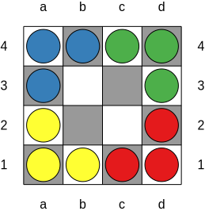
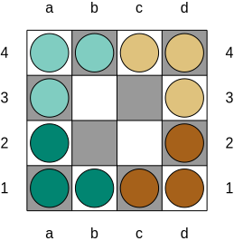
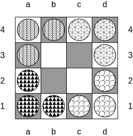

# Board Examples

## JSON Input

```json
{
   "board": {
      "style": "squares-checkered",
      "width": 4,
      "height": 4
   },
   "legend": {
      "B": {
         "name": "piece",
         "colour": 2
      },
      "G": {
         "name": "piece",
         "colour": 3
      },
      "R": {
         "name": "piece",
         "colour": 1
      },
      "Y": {
         "name": "piece",
         "colour": 4
      }
   },
   "pieces": "BBGG\nB--G\nY--R\nYYRR"
}
```

## Image Output

### Standard colours



### Colour-blind-friendly colours



### Patterns


